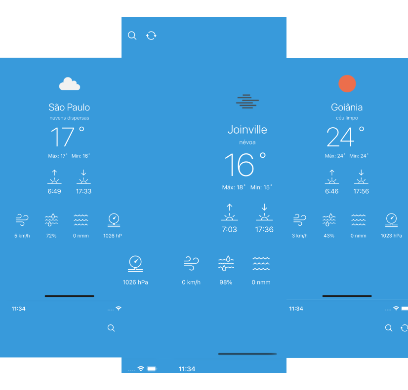

<p align="center">
  
</p>

<p align="center">
  
  
  

     
</p>

<h1 align="center">
    
</h1>

<br>

## 🧪 Tecnologias

Esse projeto foi desenvolvido com as seguintes tecnologias:

- [React-Native](https://reactnative.dev)
- [Redux](https://redux.js.org)
- [TypeScript](https://www.typescriptlang.org/)
- [Location Device](https://github.com/douglasjunior/react-native-get-location)
- [Toast](https://github.com/calintamas/react-native-toast-message#readme)

## 🚀 Como executar

Clone o projeto e acesse a pasta do mesmo.

```bash
$ git clone https://github.com/taiuanpagini/app-clima.git
$ cd app-clima
```

Para iniciá-lo, siga os passos abaixo:
```bash
# Instalar as dependências
$ yarn

# Iniciar o projeto rodando no IOS
$ cd ios && pod install && cd .. #instala as dependências via cocoapods
$ react-native run-ios

# Iniciar o projeto rodando no Android
$ react-native run-android
```
O app estará disponível no seu emulador escolhido.

## 💻 Projeto

Este projeto foi desenvolvido como um teste, pegando a localização atual do device e mostrando os dados climáticos da região. Foi utilizado com API o **[Open Weather Map](https://openweathermap.org/api)**

Foi utilizado a lib **[Reactotron](https://github.com/infinitered/reactotron)** para monitorar os logs do app e alterações no estado (Redux). Também foi utilizada a lib **[Keyboard Manager](https://github.com/douglasjunior/react-native-keyboard-manager)** para configurar o teclado do usuário no iOS.

---

by Taiuan Pagini 👋🏻